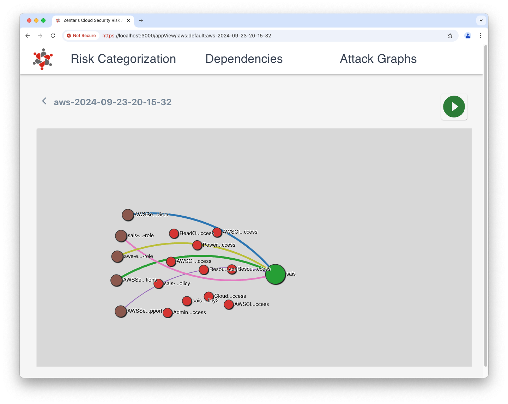
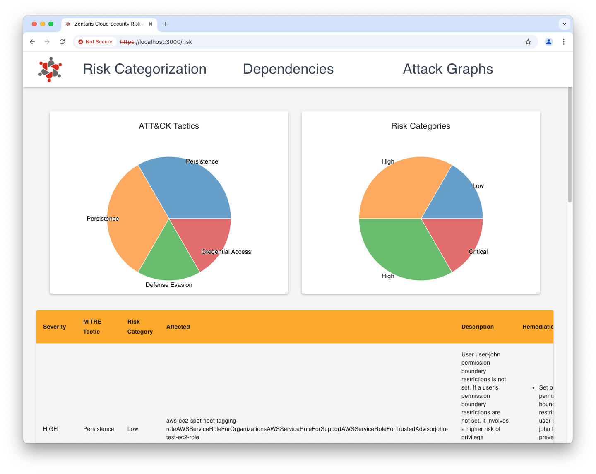
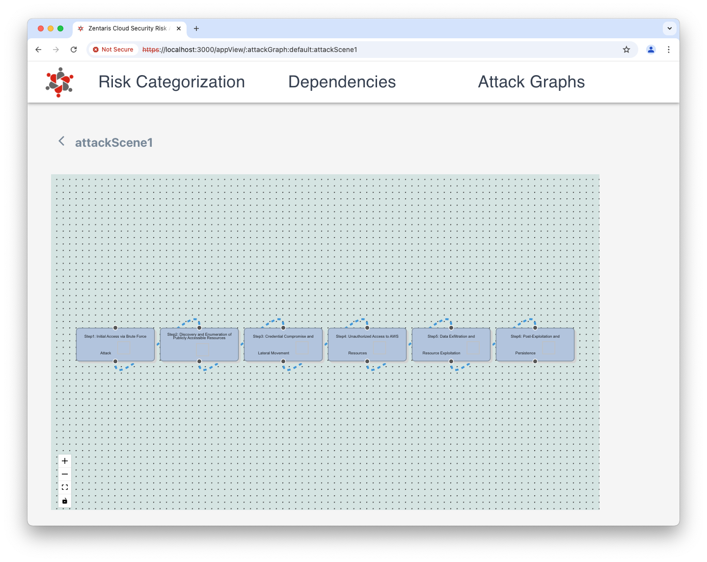

<h1 align="center">
    
    <br />
    <p style="color: #808080; text-shadow: 1px 1px 2px rgba(0, 0, 0, 0.5);">
    Zentaris Attack Path Risk Categorization
    </p>
</h1>

<br/>

## Zentaris Attack Path Risk Categorization Using Hypergraphs

Zentaris is a Cloud-Agnostic Attack Path Risk Categorization tool that maps cloud attack paths playbooks to a comprehensive risk categorization system. The framework heavily utilizes graph semantics to effectively model and evaluate risk profiles. Such a tool can be utilized to discover and categorize risks across AWS, GCP, Azure infrastructures, as well as with Kubernetes clusters. The risk evaluation system enables enterprises to categorize those playbooks ane evaluate by risk levels, providing enterprises with a contextual understanding, and threat priorities.

## Architecture

Zentaris platform comes with a backend API server, an in-memory DB, and a React application all included in the deployment package.

## Screenshots

|  |  |  |
|--------------------------------------------|--------------------------------------------|--------------------------------------------|

## Why Hypergraphs?

Hypergraphs are a set of entities (aka vertices), and a set of Hyperedges much like in a regular graph. The difference is that entities can form a set of entities of their own, and Hyperedges connect more than two vertices, leading to a set.

Hypergraphs enable complex operations on edge associations via traditional set theoretic methods. In the above example, I would have to simply take an union of `{r, w}` and `{s, x}` to obtain the largest number of permissions allowed from user2. Such queries are not possible in a regular graph. To achieve equivalent results, ABAC creates containers, that are essentially groups of users, objects, policies, etc.

Because Hypergraphs and Hyperedges work more like a set, rather than 1-1 association, any changes, updates, or crucial modifications to Hypergraph applications require operations that result in far lesser locking semantics, lesser graph traversal, thus minimizing disruptions to running of graph applications.

## Attack Scenarios Playbooks

Zentaris security scanning engines build attack scenario playbooks that can then be represented in graphs or could be downloaded to JSON for automation. Following are some example scenarios that the engines detected.

* Brute Force Access and Exploitation of Misconfigurations for Data Exfiltration and Resource Abuse. The attacker targets the AWS account login interface, attempting a brute force password attack against an account that has weak credentials. The attacker leverages their access to the EC2 instance, either by further brute-forcing SSH credentials or exploiting a misconfiguration in the instance that allows them to obtain the credentials stored within the instance. The attacker uses the compromised credentials from the EC2 instance to explore AWS IAM roles and policies attached to the instance. The attacker exfiltrates sensitive data from the S3 bucket, using the compromised EC2 instance to download the files and transfer them to an external server under the attacker’s control.

* Initial Access via Remote Desktop Protocol (RDP). An attacker exploits weak RDP credentials to gain initial access to a corporate system. After gaining access, the attacker performs reconnaissance to identify available resources and users within the network. The attacker uses tools to dump credentials stored in memory and on disk. With the dumped credentials, the attacker moves laterally to other systems within the network. The attacker identifies sensitive documents and exfiltrates them to an external server. 
 
* Initial Access via SQL Injection. An attacker discovers a vulnerable web application and uses SQL injection to access the backend database. The attacker manipulates data within the database to cover their tracks or create new user accounts with elevated privileges. The attacker exploits the web shell to escalate privileges and gain access to sensitive areas of the system. The attacker identifies sensitive data, such as customer information, and exfiltrates it to an external server.

## Discovery

Before any security scanning for risk assessment could occur, Zentaris engines must discover various entities specific to the underlying assessment environment such as AWS, GCP, or Kubernetes cluster.

Discoverable entities include cloud resources such as users, roles, policies, permission resources, access keys, monitoring logs & events, API events, object buckets such as S3, infrastructure compute resources, IPs, ports, security groups, etc.

## Risk Categorization Framework

**Attack Surface**: Assign scores based on the number and type of resources involved in an attack path (e.g., a critical data store vs. a test server).

**Exploitability**: Assess the ease with which an attacker can exploit the path (e.g., publicly accessible resources, vulnerabilities with known exploits).

**Impact**: Measure the potential impact (e.g., privilege escalation, data exfiltration, service disruption).

**Likelihood**: Include context like exposure to external traffic or insider threats.

Zentaris framework creates a composite score that ranks paths by their overall risk.

## Risk Categories

**Low Risk**: Attack paths that are unlikely to succeed or have minimal impact.

**Medium Risk**: Paths that are feasible but require multiple layers of compromise with moderate impact.

**High Risk**: Paths with a higher likelihood of exploitation and significant potential damage.

**Critical Risk**: Attack paths that are likely to succeed and lead to severe consequences, such as the loss of sensitive data or full infrastructure compromise.

## Risk Scoring System

**Accessibility**: External vs Internal. How exposed the resources on the path are (e.g., publicly accessible, internet-facing).

**Privilege Levels**: What level of access the attacker would gain at the end of the path (e.g., root or admin privileges). MITRE Attack TTP

**Data Sensitivity**: Whether the path leads to highly sensitive data or mission-critical resources.

**Vulnerability Severity**: Incorporate real-time data on known vulnerabilities (e.g. CVSS, EPSS scores).

**Dynamic Risk Calculation**: TBD

## Risk Prioritization

Prioritization: The tool should automatically prioritize attack paths with the highest risk, offering a clear path forward for security teams.

## Integration

Infra pentesting environments like CloudGoat to test vulnerable AWS scenarios. Plans to integrate other CSPM, SIEM tools for consumption.

## Zentaris Deployment

See [Zentaris Deploy](deploy/README.md) for details.

## Getting Started

Once deployed, following steps must be followed.

### Discovery

First, verify if credentials are correctly setup for discovery process.

```
$ cd discovery
$ cat credentials.sh
$ source ./credentials.sh
```

Second, trigger the discovery process using Zetafence discovery engine. Note that this discovery process relies on Zetafence backend to build graph infrastructure using APIs, which requires a platform API key.

```
$ ./discovery.sh
```

### Backend API Server and UI Server

```
$ cd deploy
$ docker-compose up -d
```

Open Zentaris dashboard by pointing browser at [https://localhost:3000](https://localhost:3000)

## Zentaris API Server

See [Zentaris API Server](apiserver/README.md) for details.

<br/>OSS sponsored with  by
    <a href="https://zetafence.com">
    </a>
2024.
