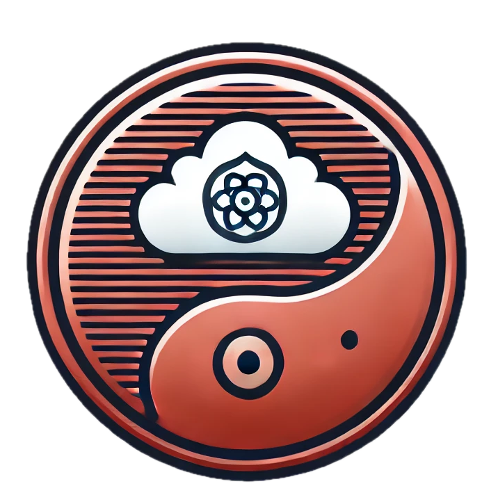

<h1 align="center">
    
    <br />
    <p style="color: #808080; text-shadow: 1px 1px 2px rgba(0, 0, 0, 0.5);">
    Zentaris Risk Monitoring Dashboard
    </p>
</h1>

<br/>

## Zentaris Cloud Security Risk Management Platform UX

Zentaris Cloud-Agnostic Attack Path Risk evaluation tool comes with a security management dashboard to view dependency graphs, and evaluate risk from there. Those risks are then displayed in risk categorization page, and attack graph pages.

## Zentaris UI Server Usage

To start UI service on default port 3000 using HTTPS, use the following commands:

```
$ yarn install
$ HTTPS=true REACT_APP_SERVER=localhost:8443 yarn start
```

To start UI server on a another port, simply set `PORT` as below:

```
$ PORT=443 && HTTPS=true && yarn start
```

# Cert CA Verification

UI server communicates with backend services via HTTPS. In modern secure systems, this
may result in cert verification failures such as invalid CA, incorrect CN, etc.

To avert these errors, following may be set in node UX server.

```
$ export SET NODE_OPTIONS=--openssl-legacy-provider
$ export SSL_CRT_FILE=/opt/certs/server.crt
$ export SSL_KEY_FILE=/opt/certs/server.key
```

<br/>OSS sponsored with  by
    <a href="https://zetafence.com">
    </a>
2024.
